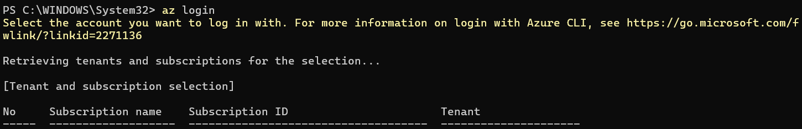

# azure-terraform-iac
# Configuración de Prerrequisitos y Autenticación en Azure

Esta sección detalla los pasos iniciales necesarios para preparar el entorno local y establecer una conexión segura con la nube de Azure antes de realizar cualquier despliegue con Terraform.

---

## 1. Prerrequisitos del Sistema

Para comenzar con este proyecto, es indispensable contar con las siguientes herramientas y accesos configurados:

* **Suscripción de Azure:** Se requiere una cuenta activa para la gestión de recursos. Puedes obtener una cuenta gratuita o para estudiantes en el siguiente enlace: [Azure Account Setup](https://azure.microsoft.com/en-us/pricing/purchase-options/azure-account?icid=azurefreeaccount).
* **Instalación Local de Terraform:** Descarga e instala el ejecutable en tu máquina local. 
    > **⚠️ Nota Crítica:** No olvides añadir la ruta de instalación a las **Variables de Entorno del sistema (PATH)** para que la terminal reconozca el comando `terraform` desde cualquier directorio.  
    [Descarga de Terraform](https://developer.hashicorp.com/terraform/install)
* **Azure CLI:** Esta herramienta permite la comunicación y autenticación entre tu máquina local y los servicios de Azure. Instálala ejecutando el siguiente comando en PowerShell:

```powershell
$ Invoke-WebRequest -Uri [https://aka.ms/installazurecliwindows](https://aka.ms/installazurecliwindows) -OutFile .\AzureCLI.msi; Start-Process msiexec.exe -Wait -ArgumentList '/I AzureCLI.msi /quiet'; rm .\AzureCLI.msi
```

---

## 2. Autenticación y Gestión de Suscripciones

Con los requisitos instalados, procedemos a configurar los permisos de acceso local para que Terraform pueda operar en nuestra infraestructura.

### Inicio de Sesión (`az login`)
Para instalar los permisos que Azure necesita para autenticarse de forma local, realizamos el inicio de sesión mediante el CLI de Azure:

```powershell
$ az login
```



> **🔒 Nota de Seguridad:** Es fundamental ocultar el **Subscription ID** y el **Tenant ID** en capturas de pantalla o entornos públicos (como este repositorio) para proteger la privacidad y seguridad de tu cuenta.

### Selección de la Suscripción Activa
Tras la autenticación, el CLI mostrará un listado de todas las suscripciones asociadas a tu cuenta. Es **fundamental fijar la suscripción activa** donde deseamos que Terraform realice los despliegues (por ejemplo, la de **Estudiantes**) para asegurar que los recursos se creen en el entorno correcto y se utilicen los créditos adecuados.

Establece la suscripción de trabajo mediante el siguiente comando sustituyendo el ID por el tuyo:

```powershell
$ az account set --subscription "TU_SUBSCRIPTION_ID_AQUÍ"
```
---

## 3. Creación del Service Principal

El siguiente paso fundamental es la creación de un **Service Principal**. En el ecosistema de Azure, un Service Principal es una identidad de aplicación (un "usuario no humano") que permite que herramientas externas, como Terraform o un pipeline de CI/CD, interactúen con tus recursos de forma segura.

### ¿Por qué es necesario este paso?
Implementar un Service Principal es una práctica estándar en la industria por los siguientes motivos:
* **Seguridad y Aislamiento:** Evitamos el uso de nuestra cuenta personal de usuario para tareas automatizadas, lo cual se considera una mala práctica en entornos profesionales y de producción.
* **Automatización:** Al proporcionar a Terraform sus propias credenciales, el sistema puede autenticarse automáticamente ante la API de Azure sin necesidad de ejecutar un `az login` manual en cada sesión.
* **Control de Accesos (RBAC):** Permite aplicar el principio de mínimo privilegio, limitando exactamente qué acciones puede realizar este "robot" (asignándole el rol de **Contributor**) y sobre qué suscripción específica tiene poder.

### Comando de Creación
Para generar esta identidad y obtener sus credenciales de acceso, utilizamos el siguiente comando:

```powershell
$ az ad sp create-for-rbac --role="Contributor" --scopes="/subscriptions/<TU_SUBSCRIPTION_ID>"
```

> **Nota:** Por motivos de seguridad, no se incluye captura de la terminal en este paso para proteger el ID de la suscripción.

### Valores Obtenidos
Al ejecutar el comando, la terminal devolverá un objeto JSON con cuatro valores fundamentales que Terraform utilizará para la autenticación:
1. **appId:** El identificador único del Service Principal (Client ID).
2. **displayName:** El nombre identificativo asignado a la identidad en Azure.
3. **password:** La contraseña o secreto de cliente (Client Secret).
4. **tenant:** El ID del directorio de nuestra organización.

---

### ⚠️ Advertencia de Seguridad
Por razones críticas de seguridad, **no se incluye una captura de pantalla de esta salida**. El valor de la **password** es extremadamente sensible:
* Solo se muestra una vez al momento de la creación.
* Permite el acceso total a los recursos bajo el rol asignado dentro de la suscripción.
* **Bajo ninguna circunstancia** debe ser compartido, enviado por canales no seguros o subido a un repositorio público.
