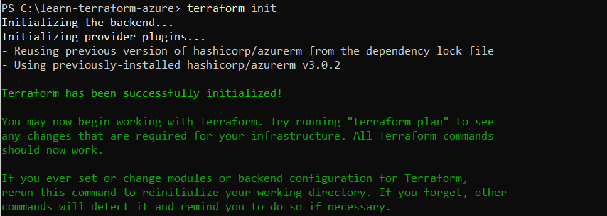
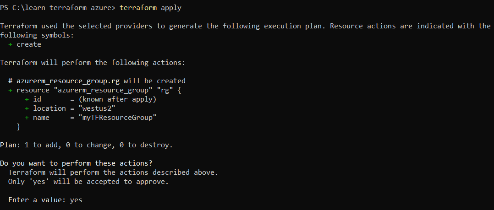
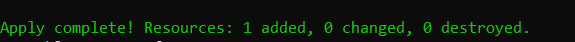
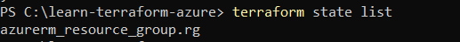
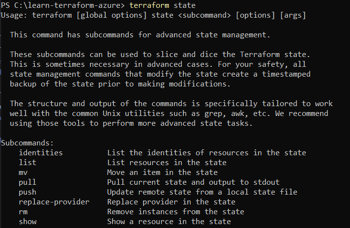
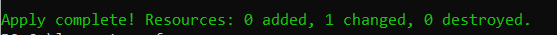

# Azure-Terraform-IaC

## 1. Prerrequisitos del Sistema

Para comenzar con este proyecto, es indispensable contar con las siguientes herramientas y accesos configurados:

* **Suscripción de Azure:** Se requiere una cuenta activa para la gestión de recursos. Puedes obtener una cuenta gratuita o para estudiantes en el siguiente enlace: [Azure Account Setup](https://azure.microsoft.com/en-us/pricing/purchase-options/azure-account?icid=azurefreeaccount).
* **Instalación Local de Terraform:** Descarga e instala el ejecutable en tu máquina local. 
    > **⚠️ Nota Crítica:** No olvides añadir la ruta de instalación a las **Variables de Entorno del sistema (PATH)** para que la terminal reconozca el comando `terraform` desde cualquier directorio.  
    [Descarga de Terraform](https://developer.hashicorp.com/terraform/install)
* **Azure CLI:** Esta herramienta permite la comunicación y autenticación entre tu máquina local y los servicios de Azure. Instálala ejecutando el siguiente comando en PowerShell:

```powershell
$ Invoke-WebRequest -Uri [https://aka.ms/installazurecliwindows](https://aka.ms/installazurecliwindows) -OutFile .\AzureCLI.msi; Start-Process msiexec.exe -Wait -ArgumentList '/I AzureCLI.msi /quiet'; rm .\AzureCLI.msi
```

---

## 2. Autenticación y Gestión de Suscripciones

Con los requisitos instalados, procedemos a configurar los permisos de acceso local para que Terraform pueda operar en nuestra infraestructura.

### Inicio de Sesión (`az login`)
Para instalar los permisos que Azure necesita para autenticarse de forma local, realizamos el inicio de sesión mediante el CLI de Azure:

```powershell
$ az login
```


> **🔒 Nota de Seguridad:** Es fundamental ocultar el **Subscription ID** y el **Tenant ID** en capturas de pantalla o entornos públicos (como este repositorio) para proteger la privacidad y seguridad de tu cuenta.

### Selección de la Suscripción Activa
Tras la autenticación, el CLI mostrará un listado de todas las suscripciones asociadas a tu cuenta. Es **fundamental fijar la suscripción activa** donde deseamos que Terraform realice los despliegues (por ejemplo, la de **Estudiantes**) para asegurar que los recursos se creen en el entorno correcto y se utilicen los créditos adecuados.

Establece la suscripción de trabajo mediante el siguiente comando sustituyendo el ID por el tuyo:

```powershell
$ az account set --subscription "TU_SUBSCRIPTION_ID_AQUÍ"
```
---

## 3. Creación del Service Principal

El siguiente paso fundamental es la creación de un **Service Principal**. En el ecosistema de Azure, un Service Principal es una identidad de aplicación (un "usuario no humano") que permite que herramientas externas, como Terraform o un pipeline de CI/CD, interactúen con tus recursos de forma segura.

### ¿Por qué es necesario este paso?
Implementar un Service Principal es una práctica estándar en la industria por los siguientes motivos:
* **Seguridad y Aislamiento:** Evitamos el uso de nuestra cuenta personal de usuario para tareas automatizadas, lo cual se considera una mala práctica en entornos profesionales y de producción.
* **Automatización:** Al proporcionar a Terraform sus propias credenciales, el sistema puede autenticarse automáticamente ante la API de Azure sin necesidad de ejecutar un `az login` manual en cada sesión.
* **Control de Accesos (RBAC):** Permite aplicar el principio de mínimo privilegio, limitando exactamente qué acciones puede realizar este "robot" (asignándole el rol de **Contributor**) y sobre qué suscripción específica tiene poder.

### Comando de Creación
Para generar esta identidad y obtener sus credenciales de acceso, utilizamos el siguiente comando:

```powershell
$ az ad sp create-for-rbac --role="Contributor" --scopes="/subscriptions/<TU_SUBSCRIPTION_ID>"
```

> **Nota:** Por motivos de seguridad, no se incluye captura de la terminal en este paso para proteger el ID de la suscripción.

### Valores Obtenidos
Al ejecutar el comando, la terminal devolverá un objeto JSON con cuatro valores fundamentales que Terraform utilizará para la autenticación:
1. **appId:** El identificador único del Service Principal (Client ID).
2. **displayName:** El nombre identificativo asignado a la identidad en Azure.
3. **password:** La contraseña o secreto de cliente (Client Secret).
4. **tenant:** El ID del directorio de nuestra organización.

---

### ⚠️ Advertencia de Seguridad
Por razones críticas de seguridad, **no se incluye una captura de pantalla de esta salida**. El valor de la **password** es extremadamente sensible:
* Solo se muestra una vez al momento de la creación.
* Permite el acceso total a los recursos bajo el rol asignado dentro de la suscripción.
* **Bajo ninguna circunstancia** debe ser compartido, enviado por canales no seguros o subido a un repositorio público.

---

## 4. Configuración de Variables de Entorno

Para que Terraform pueda autenticarse con Azure de forma automática y segura, utilizaremos **Variables de Entorno** en nuestra terminal. Esto permite que el proveedor de Azure lea las credenciales directamente de la memoria del sistema sin que estas queden registradas en el código.

### ¿Por qué se hace esto?
* **Seguridad (Evitar fugas de secretos):** Es la razón principal. Si escribimos las contraseñas dentro del código y subimos ese archivo a GitHub, cualquier persona podría robar nuestras credenciales. Al usar variables de entorno, las llaves solo viven en la memoria temporal de tu sesión de terminal.
* **Flexibilidad:** Permite que el mismo código de Terraform se ejecute en diferentes entornos (Desarrollo, Producción) simplemente cambiando las variables de la terminal, sin tocar una sola línea de código.
* **Estándar Profesional:** Es el método recomendado por **HashiCorp** y el estándar utilizado en consultoras de alto nivel como **Avanade** para proteger la infraestructura crítica.

### Comandos de Configuración (PowerShell)
Asignaremos los valores obtenidos del Service Principal mediante los siguientes comandos. Sustituye los valores en mayúsculas por tus credenciales:

```powershell
$env:ARM_CLIENT_ID = "TU_APP_ID"
$env:ARM_CLIENT_SECRET = "TU_PASSWORD"
$env:ARM_TENANT_ID = "TU_TENANT_ID"
$env:ARM_SUBSCRIPTION_ID = "TU_SUBSCRIPTION_ID"
```

---

## 5. Creación del Directorio de Proyecto

Para mantener una estructura profesional y evitar conflictos con otros experimentos, crearemos una carpeta dedicada exclusivamente a este despliegue.

### ¿Por qué es importante el aislamiento?
* **Aislamiento del Estado:** Terraform genera archivos locales críticos como la carpeta `.terraform/` y el archivo `terraform.tfstate`. Estos archivos gestionan la infraestructura de forma aislada; tener una carpeta propia evita que el estado de un proyecto sobrescriba a otro.
* **Orden y Limpieza:** Facilita la gestión del repositorio en GitHub. Un entorno limpio permite que tú o cualquier colaborador localice el archivo `main.tf` rápidamente.
* **Preparación para el Init:** El comando de inicialización (`terraform init`) debe ejecutarse siempre dentro de la carpeta raíz del proyecto para que Terraform reconozca correctamente los archivos de configuración.

### Comando de Creación
Ejecuta el siguiente comando en PowerShell para crear tu espacio de trabajo:

```powershell
$New-Item -Path "C:\" -Name "learn-terraform-azure" -ItemType "directory"$ cd C:\learn-terraform-azure
```
---

## 6. Definición de la Infraestructura (`main.tf`)

En este paso, creamos un archivo de texto plano llamado `main.tf` dentro del directorio del proyecto. Este archivo actúa como el **plano arquitectónico** de nuestra infraestructura; es el documento donde escribimos el código declarativo que Azure interpretará para construir los recursos.

### ¿Por qué se hace esto?
* **Infraestructura como Código (IaC):** En lugar de crear recursos manualmente haciendo clic en portales web (proceso propenso a errores), dejamos constancia escrita de nuestra red. Esto permite versionar el archivo en GitHub, compartirlo con otros equipos y replicar la misma infraestructura exactas veces de forma automática.
* **Declaración de Proveedores:** Especificamos que vamos a usar el proveedor oficial de Azure (`azurerm`) y definimos la versión exacta para asegurar la compatibilidad y estabilidad del proyecto a largo plazo.
* **Gestión de Recursos:** Definimos el primer componente real, el **Resource Group (Grupo de Recursos)**, que servirá como contenedor lógico para todos los elementos que creemos después (como la VNet y la Subnet).

### Código de Configuración (`main.tf`)
Copia el siguiente bloque de código dentro de tu archivo:

```hcl
# Configure the Azure provider
terraform {
  required_providers {
    azurerm = {
      source  = "hashicorp/azurerm"
      version = "~> 3.0.2"
    }
  }

  required_version = ">= 1.1.0"
}

provider "azurerm" {
  features {}
}

resource "azurerm_resource_group" "rg" {
  name     = "myTFResourceGroup"
  location = "spaincentral"
}
```

> **Nota sobre la ubicación:** En este ejemplo utilizamos `spaincentral`. Asegúrate de poner la localización en la que tu suscripción te permita crear recursos (puedes consultar las regiones disponibles en tu suscripción de Azure).

---

## 7. Inicialización del Proyecto (`terraform init`)

Una vez que el archivo `main.tf` está listo, el primer comando que debemos ejecutar es `terraform init`. Este paso es esencial para preparar el directorio de trabajo y permitir que Terraform "entienda" las instrucciones que hemos escrito.

### ¿Para qué se hace esto?
* **Descarga de Proveedores (Providers):** Terraform es una herramienta agnóstica; al leer el código, detecta que trabajaremos con Azure y descarga automáticamente el plugin oficial de `azurerm` necesario para comunicarse con su API.
* **Configuración del Backend:** Prepara el espacio donde se almacenará el **archivo de estado** (`terraform.tfstate`). Esta es la base de datos local donde Terraform registrará qué recursos ha creado y cuál es su configuración actual.
* **Verificación de Versiones:** Comprueba que la versión de Terraform instalada y los plugins descargados cumplen con las restricciones de versión que definimos en el bloque `terraform` de nuestro código.

### Comando de Inicialización
Para preparar tu entorno de trabajo, ejecuta:

```powershell
$ terraform init
```



---

## 8. Formateo y Validación de la Configuración

Antes de proceder con el despliegue en la nube, es una práctica recomendada por **HashiCorp** asegurarse de que nuestro código cumple con los estándares de estilo y es sintácticamente correcto.

### ¿Por qué se hace esto?
* **Consistencia Estética (`terraform fmt`):** Este comando formatea automáticamente tus archivos de configuración para que sigan el estilo oficial de HCL (indentación, alineación de columnas, espacios, etc.). Esto facilita enormemente la lectura del código al trabajar en equipo o al compartir tu proyecto en **GitHub**.
* **Seguridad Sintáctica (`terraform validate`):** Este comando verifica que el archivo `main.tf` no tenga errores internos. Comprueba que los nombres de los recursos sean válidos, que las referencias sean correctas y que no falten argumentos obligatorios. Esto evita que el proceso falle más tarde durante la fase de ejecución.
* **Calidad del Código:** El uso constante de estos comandos demuestra un flujo de trabajo profesional, asegurando que solo subimos a nuestro repositorio código que ha pasado un "control de calidad" previo.

### Comandos de Validación
Para asegurar la integridad de tu configuración, ejecuta:

```powershell
$ terraform fmt
$ terraform validate
```

## 9. Aplicación de la Configuración (`terraform apply`)

El comando `terraform apply` es la orden de ejecución real. A diferencia de otros comandos de consulta, este no solo simula la infraestructura, sino que abre una conexión activa con Azure para construir los recursos definidos en el `main.tf`.

### ¿Por qué es especial este paso?
* **Confirmación de Seguridad:** Por defecto, Terraform volverá a mostrarte un plan de ejecución detallado y se detendrá. Te preguntará: `"Do you want to perform these actions?"`. Esta es una red de seguridad vital para evitar despliegues accidentales o costes inesperados.
* **Interactividad Obligatoria:** El sistema no avanzará hasta que escribas exactamente la palabra **`yes`**. Cualquier otra respuesta abortará la operación de inmediato sin realizar cambios en tu suscripción de Azure.
* **Construcción en Vivo:** Una vez confirmado, verás en tiempo real cómo Azure crea el Grupo de Recursos. Al finalizar, Terraform actualizará automáticamente tu **archivo de estado (`.tfstate`)** para registrar que ese recurso ya está oficialmente bajo su control.

### Comando de Despliegue
Para aplicar los cambios y desplegar tu infraestructura en Azure, ejecuta:

```powershell
$ terraform apply
```




---

> **Nota de Transición:** Tras el éxito del despliegue, es fundamental entender el "cerebro" de la herramienta: cómo Terraform gestiona y recuerda todo lo que acaba de construir.

---

## 10. Inspección del Estado de la Infraestructura (`terraform show`)

Cuando Terraform crea recursos, genera automáticamente un archivo fundamental llamado `terraform.tfstate`. Este archivo actúa como una base de datos local que contiene los IDs y las propiedades exactas de todos los recursos que Terraform tiene bajo su control.

### ¿Por qué es importante este paso?
* **Visibilidad de Metadatos:** Al ejecutar `terraform show`, podemos inspeccionar información detallada que Azure ha asignado automáticamente (como el ID único del recurso o direcciones IP), datos que no estaban definidos en nuestro código original pero que son vitales para la infraestructura.
* **Gestión del Ciclo de Vida:** El archivo de estado es el que permite que Terraform sepa exactamente qué debe modificar o destruir en el futuro sin tener que "adivinar" qué hay desplegado en la nube. Es la "única fuente de verdad" para la herramienta.

### ⚠️ Nota de Seguridad Crítica
Es vital advertir que el archivo `terraform.tfstate` puede contener valores sensibles en texto plano.
* **Nunca debe subirse al control de versiones (GitHub).**
* Se recomienda encarecidamente añadirlo al archivo `.gitignore` desde el inicio del proyecto.

### Comando de Inspección
Para revisar el estado actual de los recursos desplegados, utiliza:

```powershell
$ terraform show
```

> **Nota sobre seguridad:** En este tutorial se omite la captura de pantalla de la salida de este comando. Tanto el archivo de estado como el comando `terraform show` muestran metadatos internos, como el **Subscription ID** y otros identificadores únicos. Compartir estos IDs en un repositorio público podría comprometer la seguridad de tu cuenta de Azure.

---

## 11. Listado y Gestión del Estado (`terraform state`)

Mientras que el comando anterior nos ofrece todos los detalles técnicos de forma extensa, Terraform proporciona herramientas específicas para listar y manipular los recursos gestionados de forma individual y simplificada.

### ¿Por qué se hace esto?
* **Inventario Rápido (`list`):** Permite obtener un listado limpio y directo de todos los recursos que Terraform está gestionando actualmente, sin necesidad de leer todo el archivo de configuración o el estado detallado.
* **Control Avanzado:** El comando `terraform state` abre la puerta a operaciones complejas, como mover recursos dentro del estado o eliminar un recurso del control de Terraform (hacerlo "invisible" para la herramienta) sin llegar a borrarlo físicamente de Azure.
* **Seguridad y Trazabilidad:** Cada vez que interactuamos con el estado, Terraform asegura que la base de datos local sea coherente con lo que realmente existe en la nube, creando copias de seguridad automáticas antes de realizar cualquier modificación crítica.

### Comando de Listado
Para ver la lista simplificada de recursos que están actualmente en tu estado, ejecuta:

```powershell
$ terraform state list
```




---

## 12. Creación de Nuevos Recursos: Red Virtual (VNet)

Una vez que el Grupo de Recursos ha sido desplegado, el siguiente paso es ampliar nuestra infraestructura añadiendo una **Red Virtual (VNet)**. En Azure, una VNet es un entorno aislado y seguro que permite que los recursos se comuniquen entre sí, con Internet y con redes on-premise.

### ¿Por qué realizamos este paso?
* **Aislamiento y Segmentación:** La VNet nos permite definir nuestro propio espacio de direcciones IP privadas. En este caso, utilizaremos el rango de red `10.0.0.0/16`.
* **Gestión Inteligente de Dependencias:** Terraform destaca por su capacidad de entender la jerarquía. Al asignar el nombre del grupo de recursos mediante una referencia (`azurerm_resource_group.rg.name`), Terraform entiende automáticamente que primero debe existir el grupo para poder crear la red en su interior.
* **Escalabilidad:** Definir la red mediante código permite que, en el futuro, podamos añadir subredes, firewalls o balanceadores de carga simplemente agregando nuevos bloques al archivo `main.tf`.

### Código para el `main.tf`
Añade el siguiente bloque a tu archivo de configuración:

```hcl
# Create a virtual network
resource "azurerm_virtual_network" "vnet" {
  name                = "myTFVnet"
  address_space       = ["10.0.0.0/16"]
  location            = "spaincentral"
  resource_group_name = azurerm_resource_group.rg.name
}
```

---

## 13. Actualización de la Infraestructura: Aplicando Cambios

Tras modificar el archivo `main.tf` para incluir la Red Virtual, debemos ejecutar nuevamente el comando de aplicación para que Terraform sincronice los cambios con la nube de Azure.

### ¿Qué sucede en este proceso?
Durante la ejecución, Terraform realiza las siguientes tareas de control:
* **Refresco de Estado (Refreshing State):** Antes de proponer cambios, Terraform contacta con Azure para confirmar que el Grupo de Recursos previo sigue existiendo y mantiene la configuración registrada en el estado local.
* **Análisis Diferencial:** Terraform compara el estado actual en la nube con el nuevo código. Detectará que el Grupo de Recursos ya está presente (`0 to change`), por lo que solo marcará para creación el nuevo recurso detectado: la VNet (`1 to add`).
* **Gestión de Atributos:** En la terminal verás valores como `guid` o `id` marcados como `(known after apply)`. Esto indica que son identificadores que Azure generará automáticamente una vez se complete la creación.

### Comando de Actualización
Para aplicar los cambios, ejecuta de nuevo:

```powershell
$ terraform apply
```

Al finalizar, el sistema devolverá el mensaje: `Apply complete! Resources: 1 added, 0 changed, 0 destroyed.`

---

## 14. Modificación de Recursos Existentes (Uso de Tags)

Una de las grandes ventajas de Terraform es su capacidad para modificar recursos existentes sin necesidad de destruirlos y recrearlos desde cero, siempre que el tipo de cambio lo permita. En este paso, añadiremos etiquetas (**tags**) a nuestro Grupo de Recursos para mejorar su organización y trazabilidad en el portal de Azure.

### ¿Por qué usamos etiquetas?
* **Organización de Costes:** Las etiquetas permiten filtrar y desglosar los gastos en la facturación de Azure (por ejemplo, para saber cuánto presupuesto consume exactamente el equipo de "DevOps").
* **Gestión de Entornos:** Ayudan a identificar rápidamente si un recurso pertenece a "Producción", "Testing" o, como en este caso, a un laboratorio de aprendizaje.
* **Actualización "In-Place":** A diferencia del cambio de ubicación (*location*), añadir etiquetas es un cambio **no destructivo**. Terraform simplemente actualizará los metadatos del recurso en Azure de forma instantánea.

### Actualización del Código (`main.tf`)
Modifica el bloque `azurerm_resource_group` en tu archivo para incluir las etiquetas:

```hcl
resource "azurerm_resource_group" "rg" {
  name     = "myTFResourceGroup"
  location = "spaincentral"
  
  tags = {
    Environment = "Terraform Getting Started"
    Team        = "DevOps"
  }
}
```

Para aplicar los cambios, ejecuta nuevamente el comando:
```powershell
$ terraform apply
```


---

## 15. Revisión de las Actualizaciones en el Estado

Tras realizar una modificación "in-place", es fundamental verificar que Terraform ha sincronizado correctamente estos nuevos valores con su archivo de estado local (`.tfstate`). Esto garantiza que la realidad en Azure coincide exactamente con lo que tenemos definido en nuestro código.

### ¿Qué estamos comprobando aquí?
* **Persistencia de Metadatos:** Al usar `terraform show`, comprobaremos que el bloque `tags` ahora aparece correctamente dentro de las propiedades del recurso.
* **Integridad del Estado:** Confirmamos que, a pesar de los cambios en los metadatos, los identificadores críticos (como el `id` o la `location`) se mantienen intactos.
* **Sincronización Total:** Esta revisión nos da la tranquilidad de que el archivo de estado está actualizado y listo para la siguiente sesión de trabajo o para compartir con el equipo.

### Comando de Verificación
```powershell
$ terraform show
```

> **🔒 Nota de Seguridad:** Por motivos de seguridad, no se incluye una captura de pantalla de este paso. La salida de `terraform show` contiene información sensible sobre la suscripción de Azure (como el Subscription ID y otros identificadores únicos) que debe permanecer privada para no comprometer la cuenta.
